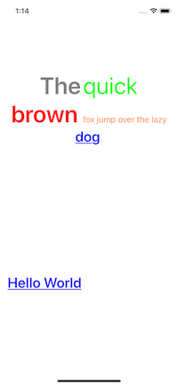

# AttributedString.swift

Swifty NSAttributed String.


# Problem
The problem is `attributes` is a `[NSAttributedStringKey: Any]`,  even though the keys  `NSAttributedString.Key` are all defined,  the values still a type of `Any`, which means we have to deal with literally `Any`thing. And feel like it's not swift.

[](https://travis-ci.org/michaelhenry/AttributedString.swift)
[](https://cocoapods.org/pods/AttributedString.swift)
[](https://cocoapods.org/pods/AttributedString.swift)
[](https://cocoapods.org/pods/AttributedString.swift)




## Installation

AttributedString.swift is available through [CocoaPods](https://cocoapods.org). To install
it, simply add the following line to your Podfile:

```ruby
pod 'AttributedString.swift'
```

## How to use
After installation, Just  `import AttributedString_swift`

```swift
import AttributedString_swift
```

When adding more **attributes** on a **NSMutableAttributedString**, you can use the `func addAttributes(attrs:[Attribute], for scope:Scope)`.

`Scope` has currently have 3 types: `.all`, `.subtext`, `closedRange`. 

## Example

```swift
import AttributedString_swift

let label1 = Label()
let label2 = Label()
...

label1.attributedText = NSAttributedString(
  string: "Hello World", 
  attrs:[
    .font(UIFont.boldSystemFont(ofSize: 30)),
    .link("https://www.google.com")
  ])

let attrText2 = NSMutableAttributedString(
  string: "The quick brown fox jump over the lazy dog.",
  attrs: [
    .font(.systemFont(ofSize: 18)),
    .foregroundColor(UIColor.orange)
  ])

// Adding more attributes!
attrText2.addAttributes(
  attrs: [
    .font(.boldSystemFont(ofSize: 50)),
    .foregroundColor(UIColor.gray)
  ],
  for: .subtext("The"))

attrText2.addAttributes(
  attrs: [
    .foregroundColor(.green),
    .font(.systemFont(ofSize: 50))
  ],
  for: .closedRange(4...8))

attrText2.addAttributes(
  attrs: [
    .foregroundColor(.red),
    .font(.boldSystemFont(ofSize: 50))],
  for: .closedRange(10...15))

attrText2.addAttributes(
  attrs: [
    .font(.boldSystemFont(ofSize: 30)),
    .link("https://en.wikipedia.org/wiki/Dog"),
  ],
  for: .subtext("dog"))

// With paragraph style for whole text
let paragraphStyle = NSMutableParagraphStyle()
paragraphStyle.alignment = .center
attrText2.addAttributes(
  attrs: [
    .paragraphStyle(paragraphStyle)
  ],
  for: .all)

label2.attributedText = attrText2
```

To run the example project, clone the repo, and run `pod install` from the Example directory first.


## Author

[@michaelhenry](https://github.com/michaelhenry)

## License

AttributedString.swift is available under the MIT license. See the LICENSE file for more info.
